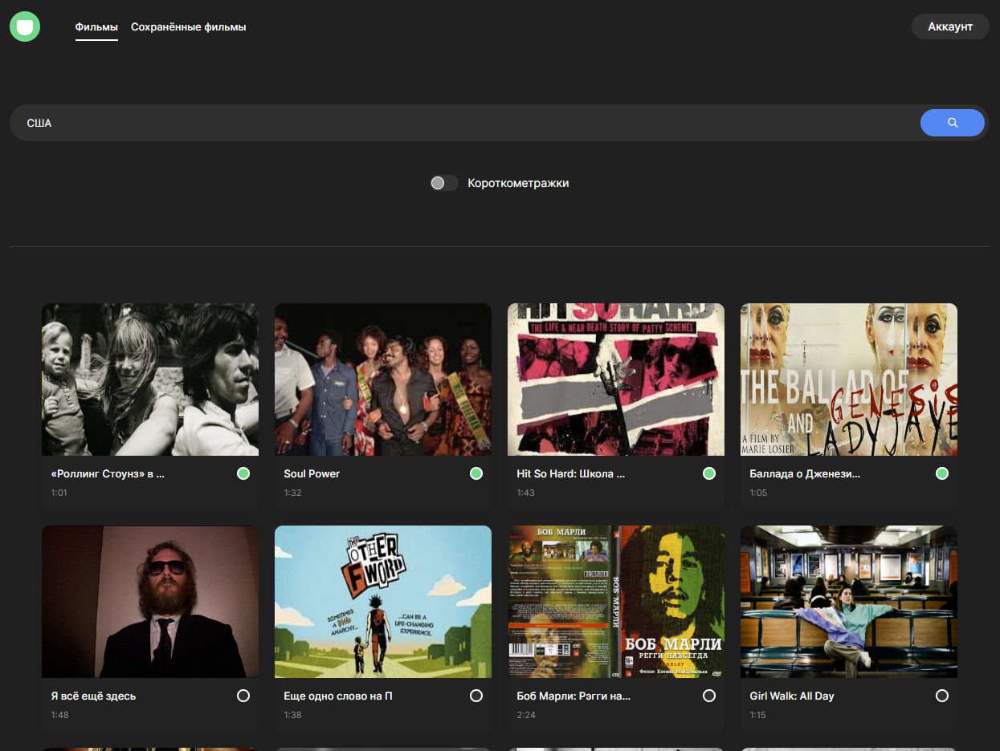

# Movies explorer frontend
Дипломный проект Я.практикум, представляющий из себя сервис по поиску фильмов.  
**npm start** - запуск на локальном сервере

## Функционал
+ Регистрация - авторизация
+ Поиск фильмов из стороннего api по ключевому слову
+ Добавление фильмов в избранное (сохраняются в свой api)
+ Редактирование информации о пользователе

## Стек
### Фронт
+ React
+ React router v6
### Бэк
+ Node.js
+ Express.js
+ MongoDB

## Описание работы
При первом посещении сайта будет открыта страница с информацией по моему обучению и моё краткое портфолио. В шапке сайта доступны кнопки "Войти" и "Регистрация".  
После авторизации, ваш токен будет сохранён, и повторная авторизация потребуется только в случае выхода из аккаунта. Также, откроется вкладка "Фильмы", где отображается поле для ввода. В поле мы можем ввести ключевое слово, характеризующее фильм: Часть названия (на русском или английском) или страна. После ввода нажимаем на кнопку с лупой и получаем отфильтрованные фильмы. При клике по фильму мы перейдём на трейлер этого фильма. Также на каждой карточке с фильмом доступна кнопка добавления в избранное.   
Доступна вкладка "Аккаунт", где можно изменить своё имя и почту, а также выйти из аккаунта.

Ссылка на макет:
https://disk.yandex.ru/d/P60ZTJWsojAPzw

Ссылка на пулл-реквест:
https://github.com/Kirill-Kor/movies-explorer-frontend/pull/2
